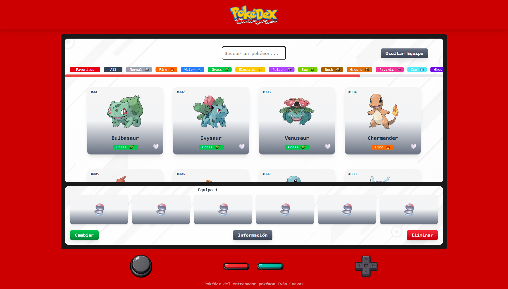

# Pokédex Web App

[Demo](https://IvanCuevas-dev.github.io/pokedex)

Aplicación web interactiva que consume la [PokeAPI](https://pokeapi.co/) para mostrar información de los 151 Pokémon originales en una interfaz inspirada en la Pokédex clásica.

Desarrollado como proyecto de portfolio durante mis prácticas en desarrollo web.

---

## Vista previa



---

## Descripción

La aplicación obtiene datos de la PokeAPI y genera dinámicamente tarjetas de Pokémon mediante JavaScript puro y manipulación del DOM, sin frameworks adicionales.

La interfaz simula una Pokédex física con animación de encendido, pantalla principal con scroll y un panel de equipo donde el usuario puede organizar hasta 3 equipos diferentes.

---

## Tecnologías

| Tecnología | Uso |
|---|---|
| HTML5 | Estructura y semántica |
| CSS3 | Animaciones y estilos base |
| Tailwind CSS v4 | Utilidades de diseño responsive |
| JavaScript ES6 | Lógica, DOM y consumo de API |
| PokeAPI | Fuente de datos |
| Git & GitHub | Control de versiones |

---

## Funcionalidades

- Carga de los 151 Pokémon originales desde la PokeAPI
- Tarjetas generadas dinámicamente con imagen, nombre, ID y tipo
- Buscador en tiempo real por nombre o número
- Filtros por tipo de Pokémon con iconos
- Sistema de favoritos persistente con `localStorage`
- Modal de detalle con stats, peso y altura
- Creación y gestión de 3 equipos Pokémon independientes
- Panel de equipo con drag & drop en escritorio
- Panel de equipo adaptado para móvil y tablet
- Interfaz responsive con diseño diferenciado por breakpoint

---

## Estructura del proyecto

```
pokedex/
│
├── index.html
├── README.md
│
├── css/
│   ├── animations.css
│   └── scroll.css
│
├── js/
│   ├── ui_config.js       # Referencias DOM y configuración visual
│   ├── api.js             # Llamadas a la PokeAPI
│   ├── main.js            # Inicialización y renderizado de cards
│   ├── search.js          # Filtros, buscador y favoritos
│   ├── pokemon_modal.js   # Modal de detalle del Pokémon
│   ├── team.js            # Lógica del sistema de equipos
│   └── confirm_modal.js   # Modal de confirmación genérico
│
└── img/
    ├── types/             # Iconos de cada tipo
    └── ...                # Imágenes globales
```

---

## Instalación

```bash
git clone https://github.com/tu-usuario/pokedex.git
cd pokedex
```

Abrir `index.html` directamente en el navegador. No requiere servidor ni dependencias adicionales.

---

## Estado del proyecto

En desarrollo activo. Las funcionalidades principales están implementadas y funcionales. Se siguen añadiendo mejoras de forma progresiva.

---

## Mejoras planificadas

- Implementar evoluciones y habilidades en el modal de detalle
- Persistencia del equipo en `localStorage`
- Mejora del panel de equipo en móvil/tablet

---

## Autor

**Iván Cuevas** — Desarrollador Web Junior  
Estudiante de Desarrollo de Aplicaciones Web